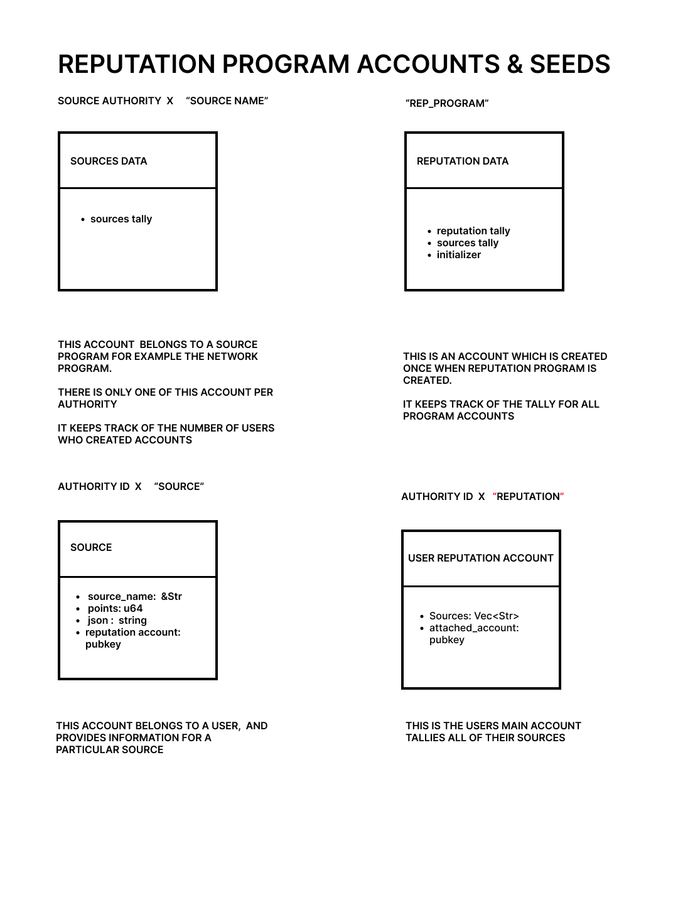

# Reputation.sol

A protocol that creates an account(s) that a user can attach to their sol account. This account collects different kinds of community credits, 
which the user can use as reputation throughout the Solana ecosystem.

Reputation can be used for example to
 <ol>
    <li/>confirm that the account belongs to a real person.</li>
    <li/>Confirm that a person is active in a certain community</li>
    <li/>Confirm that a person meets certain criteria</li>
    <li/>Confirm that a person has completed certain requirements</li>
 </ol>

## Reputation data
This is a single account that tallies the number of solana keypairs attached to reputation accounts 
a reputation.(one account)

## Source data
This is an account that is created by programs that want to supply sources for user credits
Multiple of these accounts exist and each one stores meta data for each source.(multiple sources one per source)

## Source
This is an account that stores user source data, how many points a user has for a particular 
source.(multiple per user)

## Reputation 
this is an account 1 per user that that stores meta data for the user source accounts 

## Thought crumbs 
Participate in certain activities given your stake,
you are allowed into certain experiences based on your reputation.
Reputation protocol uses activity, tags from other people,
and other custom, reputation building activities that users can create.
All reputation accounts are horizontal and do not use hash map like hierachy 
this allow the accounts to be used by other programs without requiring a chain of 
dependent accounts to derive the address.

### Reputation token
This is a token that you can buy to quickly build your reputation.

