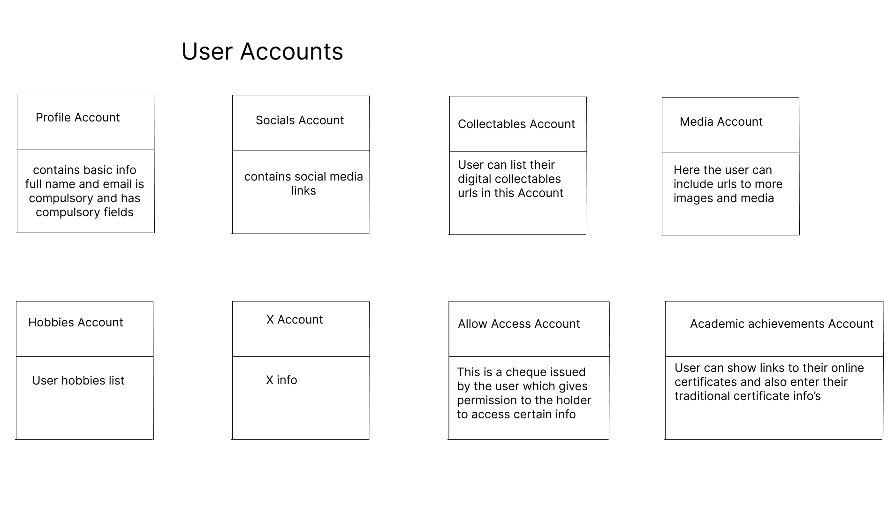

# A blockchain based profile standard

instead of every future dapp collecting redundant user info onchain a user can have a profile info tree of accounts that the user can user whenever their information is required online for more formal applications that may need KYC like for example user resume , reputation based apps for remittances, couriers etc

### user accounts diagram 1

